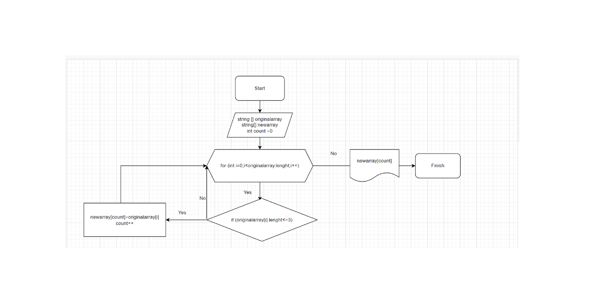

# **Контрольная работа по первому блоку**
## Задача
Написать программу, которая из имеющегося массива строк формирует новый массив из строк, длина которых меньше, либо равна 3 символам. Первоначальный массив можно ввести с клавиатуры, либо задать на старте выполнения алгоритма. При решении не рекомендуется пользоваться коллекциями, лучше обойтись исключительно массивами.*

## Решение
* В сответствии с заданием создается репозиторий на GitHub.
* Создается блок-схема. 
* Оформляется настоящий файл.
* Объявляеются массивы "originalarray" и "newarray".
* Объявляется переменная count.
* Объявляется метод и с помощью цикла, пробегаем по длине массива originalarray.
* Когда длина строк по условию совпадает, эту строку вносим в count массива newarray. 
* В том случае, если ничего не подходит по условию, то count будет равен 0.
* И, наконец, выводим массив newarray в консоль.